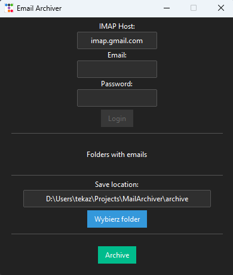

# Calculator Application using `ttkbootstrap`

This is a simple calculator application built using `ttkbootstrap` and `tkinter` in Python. The application provides basic arithmetic operations and a user-friendly interface with styled widgets.

## Table of Contents

- [Installation](#installation)
- [Running the Application](#running-the-application)
- [Features](#features)
- [Files](#files)
- [Contribution](#contribution)
- [License](#license)

## Installation

To run application, you need clone this repository to your local disk:

sh

`git clone https://github.com/your-username/repository-name.git cd repository-name`

You need Python and the TtkBootstrap library installed. You can install them using the following commands:

sh

`pip install ttkbootstrap`

You can also use the requirements.txt file:

sh

`pip install -r requirements.txt`

## Running the Application

To run the application, simply execute the following command in the terminal while in the project directory:

sh

`python main.py`

## Features

- Basic arithmetic operations: addition, subtraction, multiplication, division
- Styled using ttkbootstrap
- Responsive and user-friendly interface

## Files

### Main Application Files

- **main.py**: Contains the main application code, initializes the main window, creates the widgets, and handles the layout.
- **functions.py**: Contains the functions used for handling button presses and performing calculations.

### Dependencies

- **ttkbootstrap**: Library for styling Tkinter applications.

## Contribution

If you want to contribute to the development of this project, open an issue or create a pull request. New features, bug fixes, and code optimizations are always welcome.

## License

The project is available under the MIT license. Details can be found in the LICENSE file.